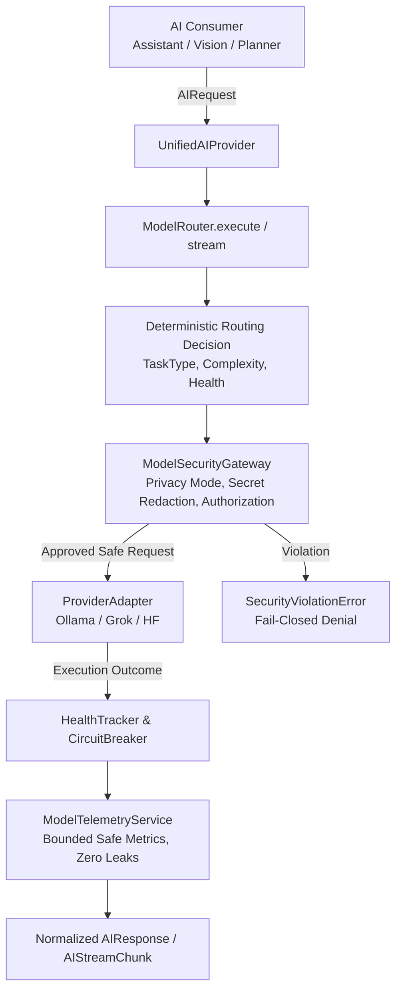

# RYVEN 3.0 — M17.10 Phase 6: Complete AI Consumer Unification & Inference Governance

## Overview

Milestone 17.10 Phase 6 completes the unification of all AI inference consumers across RYVEN 3.0 behind an authoritative, single execution boundary:
1. **Request Construction**: Standardized `AIRequest` payload.
2. **Authoritative Routing Decision**: Deterministic routing via `ModelRouter`.
3. **Security Inspection & Privacy Gating**: Authorization, privacy mode compliance, and secret redaction via `ModelSecurityGateway`.
4. **Adapter Dispatch**: Isolation through `ProviderAdapter` implementations (`OllamaAdapter`, `GrokAdapter`, `HuggingFaceAdapter`).
5. **Safe Response Normalization**: Uniform `AIResponse` / `AIStreamChunk` with backward-compatible aliases.
6. **Operational Telemetry & Audit**: Privacy-preserving metrics and correlation tracking via `ModelTelemetryService` and `action_bus`.

---

## 1. Consumer Inventory & Migration Status

| Consumer | Location | Prior State | Phase 6 Unified State | Compliance |
| :--- | :--- | :--- | :--- | :--- |
| **Assistant** | `backend/app/core/assistant.py` | Direct `OllamaProvider()` default | Defaults to `unified_ai_provider`; routes chat completions through `UnifiedAIProvider` / `ModelRouter`; handles `SecurityViolationError`, `ProviderUnavailableError`, `ProviderTimeoutError`; supports streaming via `ai_provider.stream()` | **100% Compliant** |
| **Vision Provider** | `backend/app/ai/vision.py` | Direct `OllamaProvider(model=...)` | Delegates `analyze_image` through `self._router.execute(req, allow_remote=False, task_type=TaskType.VISION)` | **100% Compliant** |
| **Perception Agent** | `backend/app/ai/vision.py` | Standalone OCR / vision flow | Routes image perception and OCR through unified `VisionProvider` and `ModelRouter` with strict local-only enforcement | **100% Compliant** |
| **LLM Planner** | `backend/app/agents/llm_planner.py` | Injected `AIProvider` | Fully aligned with `UnifiedAIProvider.generate()` using `TaskType.PLANNING` and structured output schemas | **100% Compliant** |
| **Unified AI Provider** | `backend/app/ai/unified.py` | Separate routing branches | All `generate()` calls delegate strictly to `self.router.execute()`; all `stream()` calls delegate to `self.router.stream()`; synchronizes custom injected transports with router adapters | **100% Compliant** |

---

## 2. Authoritative Inference Pipeline

Every inference call across RYVEN 3.0 follows a single, uninterrupted lifecycle:

### Invariants Enforced:
1. **Local Default**: Qwen 2.5 7B through local Ollama remains the default for all routine reasoning, assistant queries, vision, and planning.
2. **Zero Remote Egress by Default**: Remote providers (`GROK`, `HUGGINGFACE_REMOTE`) are strictly disabled by default and blocked under `LOCAL_ONLY` and `PRIVACY_FIRST` modes without explicit user confirmation tokens.
3. **Fresh Security Checks on Fallback**: Fallback attempts cannot bypass `ModelSecurityGateway`; every fallback candidate must undergo independent security inspection.
4. **Bounded Fallback Depth**: Hard cap of `max_fallback_depth = 1`. Cyclic fallback loops are forbidden.
5. **Circuit Breaker Fail-Fast**: When a provider circuit breaker is OPEN, subsequent requests fail immediately with `ProviderUnavailableError` without invoking adapter network calls.
6. **Telemetry Failsafe**: Telemetry failures are safely caught and never disrupt inference, nor can they weaken or bypass gateway authorization.

---

## 3. Streaming Consistency & Cancellation Safety

- **Pre-Stream Gateway Validation**: Security policy inspection, authorization verification, and secret scanning execute strictly before any provider transport connection opens.
- **Chunk-Boundary Sanitization**: `StreamChunkSanitizer` cleans internal `<think>` tags and masks credentials across arbitrary chunk splits.
- **Provider Switching Prohibited Mid-Stream**: If any visible token delta has been emitted to the caller, provider fallback is strictly refused to avoid stream corruption.
- **Cancellation Propagation**: Standard `asyncio.CancelledError` interrupts iteration cleanly and registers `STREAM_CANCELLED` telemetry without leaking buffer contents.

---

## 4. Telemetry Governance & Privacy Guarantees

- **Correlation ID Preservation**: A single `request_id` is propagated across all attempts, fallback operations, security decisions, and stream events.
- **Zero Raw Data Persistence**: Prompts, system messages, model responses, confirmation tokens, and raw credentials are never persisted to telemetry buffers or audit logs.
- **Low-Cardinality Error Taxonomy**: Error messages and exceptions are sanitized into low-cardinality error categories (`PROVIDER_TIMEOUT`, `SECURITY_VIOLATION`, `PROVIDER_UNAVAILABLE`, `RATE_LIMIT_EXCEEDED`).
- **Telemetry Deduplication**: Logical requests are tracked once at the router boundary, preventing duplicate counts when both a consumer and router observe the same completion.

---

## 5. Security Audit: Remaining Direct Provider Sites

Repository-wide search confirms zero unresolved application bypasses:
1. `backend/app/ai/adapters.py:50`: `OllamaAdapter` initializes transport `OllamaProvider` as approved low-level adapter transport.
2. `backend/app/ai/vision.py:117`: `VisionProvider` retains `_provider` reference for backward-compatible initialization; actual analysis calls delegate to `_router.execute()`.
3. `backend/app/ai/unified.py:46`: `UnifiedAIProvider` retains `ollama` reference for transport injection compatibility; all generation calls delegate to `router.execute()`.
