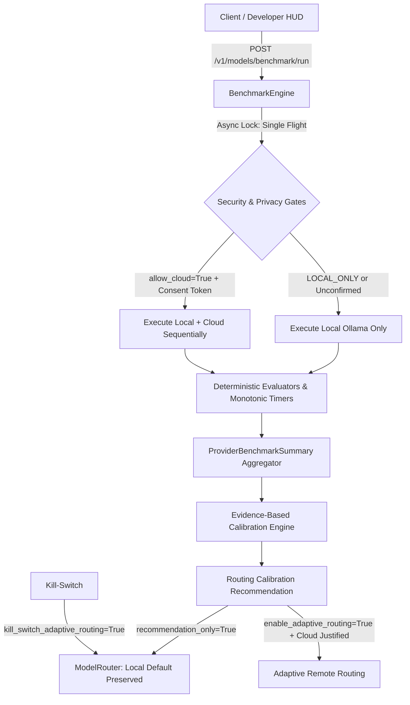

# RYVEN 3.0 — Milestone 17.11 Documentation
## Hybrid AI Benchmark Engine & Evidence-Based Intelligent Routing

### 1. Architectural Overview

Milestone 17.11 introduces a lightweight, resource-aware, empirically grounded benchmark engine and calibration mechanism into RYVEN 3.0. The engine benchmarks the default local provider (**Ollama + Qwen 2.5 7B**) against optional cloud inference (**Hugging Face Qwen 2.5 Coder 32B**) to produce deterministic, explainable routing recommendations.

---

### 2. Core Components

#### 2.1 BenchmarkEngine (`backend/app/ai/benchmark.py`)
- **Single-Flight Execution**: Guarantees that only one benchmark run executes at any time via `asyncio.Lock()`. Concurrent runs return HTTP 409 Conflict.
- **Laptop Hardware Guardrails**: Caps samples per task between 1 and 3 (default: 1) to protect CPU/memory resources on the Intel Core i5 / 16 GB RAM development laptop.
- **Monotonic Metrics**: Uses `time.monotonic()` for precise elapsed duration and streaming Time-to-First-Token (TTFT) calculations.
- **Truthful Token Accounting**: Computes tokens/second strictly when verified `completion_tokens` (> 0) and non-zero duration are reported. Returns `None` if token accounting is unsupported by the provider.

#### 2.2 Versioned Synthetic Evaluation Suite (`v1.0.0`)
All benchmark tasks are strictly non-sensitive, public, reproducible, and evaluated deterministically:

| Category | Task ID | Verification Type | Evaluation Rubric |
| :--- | :--- | :--- | :--- |
| **Simple Question** | `simple_geo_01` | Regex Match | Exact case-insensitive match for `\bParis\b` |
| **Small Coding** | `coding_multiply_02` | Python Unit Test Sandbox | Safe AST parse + sandboxed test runner for `multiply(a, b)` |
| **Structured Output** | `structured_json_03` | JSON Schema & Typing | JSON extract + required fields (`server_name`, `healthy`, `active_connections`) + type checks |
| **Reasoning** | `reasoning_speed_04` | Regex Match | Deterministic numerical extraction for `262.5` |
| **Code Debugging** | `debugging_offbyone_05` | Python Unit Test Sandbox | Safe AST parse + test runner for off-by-one fix `take_first_n(items, n)` |

#### 2.3 Evidence-Based Calibration Logic
- **Local Parity Rule**: If cloud quality is not strictly higher than local quality by at least 15% on complex tasks (coding/reasoning), local Ollama remains the recommended provider.
- **Zero Hallucination**: If insufficient samples (<2) are available or no remote provider was probed, the recommendation retains the local-first default with confidence `0.2` or `0.85` and explicit explanation.
- **Evidence Summary**: Exposes concrete local vs. remote quality scores and median latency percentiles in `CalibrationRecommendation.evidence_summary`.

#### 2.4 Router Integration & Adaptive Safeguards (`backend/app/ai/router.py`)
- **Defaults**:
  - `RouterConfig.recommendation_only = True`
  - `RouterConfig.enable_adaptive_routing = False`
  - `RouterConfig.kill_switch_adaptive_routing = False`
- **Kill-Switch**: Setting `kill_switch_adaptive_routing = True` immediately halts any adaptive routing and forces local deterministic routing.
- **Privacy Gate Preservation**: Even under adaptive routing, `LOCAL_ONLY` privacy mode, prompt credential scans, or missing confirmation tokens block remote calls and fall back to local Ollama.

---

### 3. REST API Endpoints

| Method | Path | Description | Safety & Auth Constraints |
| :--- | :--- | :--- | :--- |
| `POST` | `/api/v1/models/benchmark/run` | Triggers sequential synthetic evaluation suite | Rejects concurrent runs (409); cloud requires explicit opt-in & token |
| `GET` | `/api/v1/models/benchmark/results` | Retrieves latest benchmark metrics & summaries | Read-only; zero prompt or raw response leakage |
| `GET` | `/api/v1/models/benchmark/calibration` | Retrieves current evidence-based routing advice | Read-only; explainable rationale |

---

### 4. RAVAN UI Integration (`RAVAN/src/components/developer/ModelStatusPanel.tsx`)

The Model Status Panel in the developer HUD includes:
- **Action Triggers**: "PROBE LOCAL" and "PROBE CLOUD" buttons with in-flight disable state.
- **Provider Metric Matrix**: Live display of Quality %, P50 Latency (ms), TTFT (ms), and Tokens/sec.
- **Evidence Routing Advice Card**: Badge indicating `LOCAL OPTIMAL` or `CLOUD JUSTIFIED`, with plain-English calibration explanation.

---

### 5. Verification Summary

- **Targeted Benchmark Engine Tests**: 23/23 passed (`tests/test_m17_11_benchmark.py`).
- **Regression Test Suites**:
  - Phase 7 (Hugging Face Cloud Provider): 20/20 passed.
  - Phase 6 (AI Consumer Unification): 34/34 passed.
  - Phase 5 (Telemetry & Observability): 36/36 passed.
  - Phase 4 (Model Security Gateway): 36/36 passed.
  - Phase 3 (Router & Circuit Breakers): 32/32 passed.
  - Phase 2 (Streaming & Sanitizer): 31/31 passed.
  - Phase 1 (Provider Contracts & Adapters): 56/56 passed.
- **Frontend Production Build**: `npm run build` completed successfully with 0 errors.
